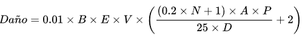

# PII 2024 - Equipo 29

## Universidad Católica del Uruguay
**Facultad de Ingeniería y Tecnologías**  
**Asignatura:** Programación II  

## Integrantes del equipo
- **Leandro Pereira**: [LeandroPereira23](https://github.com/LeandroPereira23)
- **Matías Pérez**: [MatiXV23](https://github.com/MatiXV23)
- **Anna Paula Tomas**: [pauuuutomas](https://github.com/pauuuutomas)
- **Gabriel Fioritti**: [GabrielFioritti](https://github.com/GabrielFioritti)

# Pasos para utilizar el bot

## 1) Token para el bot de discord
Se ha implementado el uso de variables de entorno para evitar subir el token del bot de discord a Github.

Para su correcto funcionamiento se debe ejecutar el siguiente comando en la terminal de **PowerShell**:
`setx DISCORD_TOKEN "<Token>"`.

Posteriormente, será necesario reiniciar la computadora.

## 2) Invitar el bot a un servidor de discord
Clickea el siguiente enlace para invitar el bot al servidor: [Enlace de invitación.](https://discord.com/oauth2/authorize?client_id=1297389213922361396&permissions=8&integration_type=0&scope=bot+applications.commands)

## 3) Encender el servidor
Se deberá encender el servidor ejecutando el código para que el bot empiece a funcionar.

## 4) ¡Ya puedes jugar!
Para empezar a jugar utiliza el comando `/Play`. Esto empezará a buscar partida contra otro jugador.

## Comandos del bot
- `/play`: Entrar en lista de espera.
- `/choose`: Elegir pokemon para tu equipo. Se necesita enviar el nombre de pokemon.
- `/start`: Permite comenzar una partida antes de alcanzar el máximo de pokemon por jugador. En caso de no usar el comando, comienza automáticamente al llegar al máximo de pokemons.
- `/showcatalogue`: Envia el link del catálogo web.
- `/attack`: Ataca al pokemon del jugador rival. Se necesita enviar el indice del movimiento (debe ser 1, 2, 3 o 4).
- `/nextturn`: Cambia de turno.
- `/change`: Cambia el pokemon actual por el enviado como parametro. Se necesita enviar el nombre de pokemon.
- `/item`: Utiliza el item correspondiente en ese índice en el pokemon deseado. Se necesita enviar el índice del item y el nombre del pokemon donde se va a utilizar el item.
- `/waitlist`: Muestra la lista de jugadores esperando.
- `/showitems`: Muestra una descripción de los items.
- `/restart`:  Resetea la partida en el canal de batalla.

## Notas del bot
- Para ver la lista de comandos disponibles escribe `\` y se debería mostrar una lista con los comandos disponibles.
- En caso de que no se muestren los comandos deberás reiniciar discord o utilizar la combinación de teclas `Ctrl + R`.
- Los comandos del bot están explicados a detalle en la documentación.

# Formula de ataque de un Pokemon
Se estudió la manera en como implementar los ataques de los pokemons, para lo cual se encontró la siguiente fórmula:

  

- **B**: Bonificación. Si el ataque es del mismo tipo que el Pokémon que lo lanza, toma un valor de 1.5. Si el ataque es de un tipo diferente, toma un valor de 1.
- **E**: Efectividad. Puede tomar los valores de 0, 0.5, 1 o 2. (Hay casos especiales donde puede tomar valores de 0.25 o 4. Esto puede pasar si el pokemon atacado tiene más de un tipo).
- **V**: Variación. Un valor aleatorio entre 85 y 100.
- **N**: Nivel del Pokémon atacante (Por defecto, 1).
- **A**: Ataque o ataque especial del Pokémon. Si el ataque es físico, se toma el ataque. Si es especial, se toma el ataque especial.
- **P**: Poder del ataque.
- **D**: Defensa del Pokémon rival. Si el ataque es físico, se toma la defensa física. Si es especial, se toma la defensa especial.

La formula fue extraida de [Wikidex](https://www.wikidex.net/wiki/Daño)

# Implementación de una pokédex para la búsqueda de pokemons
Se implementó una **Pokédex** para permitir que el usuario busque entre los 1025 pokémons, esto facilitará al usuario que vaya a utilizar el bot, a la hora de buscar los pokemons, podrá filtrar por cada tipo de pokemon o ordanar la lista por ID, nombre, vida, ataque o defensa. 
La Pokédex se encuentra disponible en el siguiente enlace: [Pokédex](https://pokemon-blog-api.netlify.app)

# PokeAPI
Para integrar la PokeAPI en el programa, investigamos cómo obtener todos los datos de los pokemons, incluyendo los datos necesarios para utilizar la formula de ataque previamente mencionada. 
Actualmente ya se está consumiendo la PokeAPI dentro del programa, se creó una clase PokeApiService que se encarga de extraer los datos necesarios de los pokemon y movimientos de los mismos.
Después, se adaptan los datos extraidos de la PokeAPI con la clase PokemonAdapter a el formato utilizado en la clase Pokemon.
Enlace: [PokeAPI](https://pokeapi.co).

# Principios SOLID utilizados
- **SRP** (Principio de Responsabilidad Única): Se utiliza en varias partes de la aplicación para separar responsabilidades en las clases. Por ejemplo:
  - En el caso de Pokemon, se separa las responsabilidades de los movimientos (Move), tipos (Type) y calculos de ataque (Calculate) en clases separadas, utilizando la lógica de las mismas en Pokemon.
- **DIP** (Prinicipio de Inversión de Dependencias): Las clases de alto nivel no deberían depender de clases de bajo nivel, sino que ambos deberían depender de abstracciones. Esto se aplica en varias partes de la aplicación, por ejemplo:
  - En el método Attack en la clase Pokemon, utilizamos una variable calculate de tipo ICalculate y lo instanciamos con la clase Calculate.
  - En el método Attack de la clase GameCommands, creamos una variable del tipo IPokemonManager y la inicializamos con una instancia del Player ganador si lo hay. También en ese mismo método se crea otra variable de tipo IPokemonManager con el valor del Player que no está en turno.
  - En el método ApplyStateEffect de la clase StateApplier se crea una variable de tipo IPokemonState, la cual se inicializa con un estado Burn, Normal, Paralyze, Poison o Sleep, dependiendo del valor recibido en el método.
- **OCP** (Prinicipio Abierto/Cerrado): Se aplica en el StateMachine en conjunto con las clases relacionadas a los estados de los pokemon. En caso de querer agregar un nuevo estado, se debería crear una nueva clase que implemente <c>IPokemonState</c>,
  agregar el nombre del estado en el <c>EnumState</c> y extender la clase <c>StateApplier</c> donde se agregan los estados a los pokemon. Esto permitiría agregar un efecto con un nuevo comportamiento sin modificar las clases pertinentes, extendiendo a las mismas.
  Esto permite que el código sea más mantenible y extensible a futuro.

# Patrones de diseño utilizados
- **Facade**: Se implementó una clase `Game` que centraliza todas las clases y la lógica necesaria para el funcionamiento del juego.
- **Adapter**: Se implementó una clase `PoekmonAdapter` para adaptar los datos obtenidos de la PokeAPI a el formato utilizado en la clase `Pokemon`.
- **State**: Se implementó una maquina de estados que maneja el estado actual de cada `Pokemon`. Dentro de la máquina de estados se encuentra un atributo 
que contiene el estado actual `CurrentState` donde guarda una instancia de una clase que implemente la interfaz `IPokemonState`. 
Dependiendo del estado que tenga el `Pokemon` va actuar de forma distinta al llamar a cualquier método de `StateMachine`.
- **Singleton**: Se implementó el patrón Singleton para tener una única instancia de la clase `Lobby` en todo el programa, por lo que nos permite evitar problemas en el emparejamiento de jugadores.

# Notas
- EL diagrama **UML**, las tarjetas **CRC** y la documentación generada por doxygen están dentro de la carpeta **Docs**.
- El UML fue creado utilizando código mermaid. Para la última entrega se va a tratar de mejorar la disposición de elementos.
